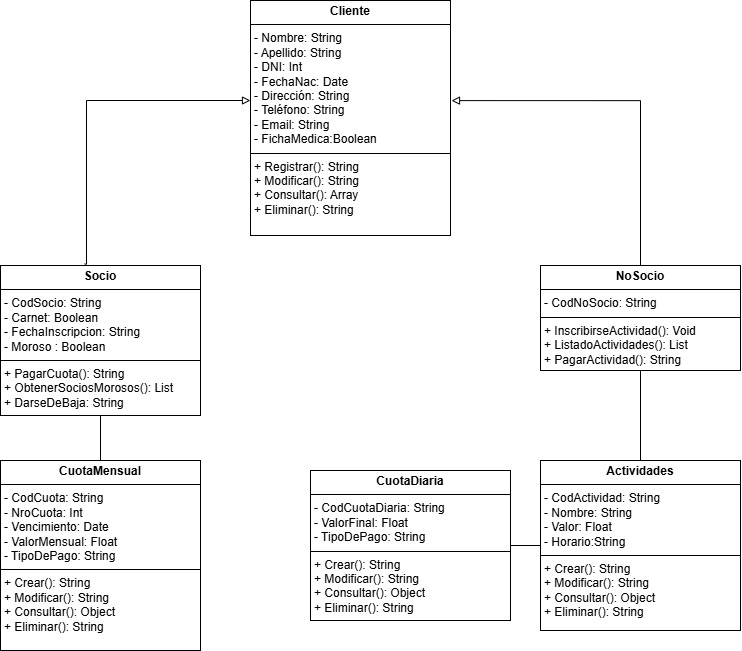

<h1>Proyecto Integrador | Sistema Club Deportivo</h1>
<h2>Diseño de Sistemas Orientado a Objetos | Equipo 6</h3>

 

### Requerimientos del Cliente

* Desarrollar un sistema que permita administrar de manera eficiente el servicio prestado a fin de controlar:
    * Registro de los socios y de los no socios.
    * Entrega de carnet y cobro de cuota mensual o diaria.
    * Listado diario de los socios que en la fecha les vence la cuota.

 

### Diagrama de Clases

 

### Diagrama de Casos de Uso

 

